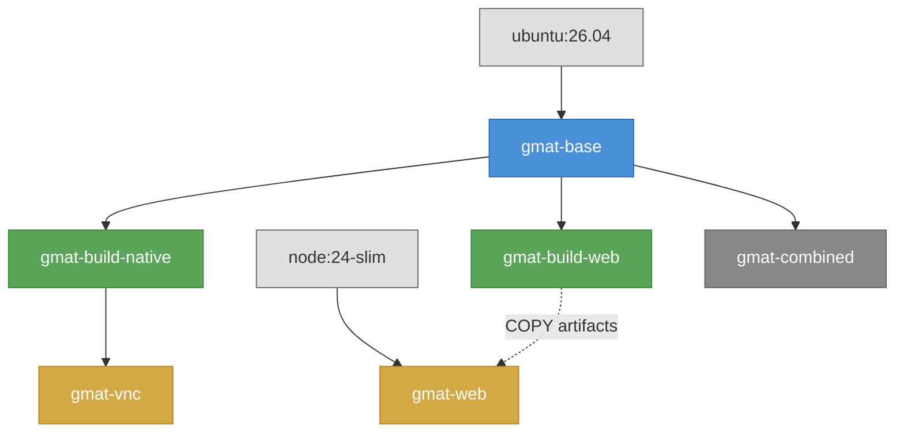

# GMAT Container Tasks

- [GMAT Container Tasks](#gmat-container-tasks)
  - [Quick start](#quick-start)
  - [Per-service](#per-service)
  - [All services](#all-services)
  - [Build targets](#build-targets)
  - [CI (local testing with act)](#ci-local-testing-with-act)
  - [Utility](#utility)

## Quick start

```
docker run -d -p 127.0.0.1:15801:80 \
  --platform linux/amd64 \
  --name gmat-vnc \
  --hostname gmat-vnc \
  ghcr.io/haisamido/gmat-ui/gmat-vnc:latest
```

Open http://localhost:15801/vnc.html

To stop and remove:

```
docker stop gmat-vnc && docker rm gmat-vnc
```

Or with Task:

```
task build:vnc        Build the VNC image
task up:vnc           Start the VNC service
                      Open http://localhost:15801/vnc.html
```

## Per-service

Replace `web` with `vnc` or `console`.

```
task build:web        Build image
task rebuild:web      Rebuild image (no cache)
task up:web           Start service  (aliases: start:web, run:web)
task down:web         Stop service   (aliases: stop:web)
task logs:web         Follow logs
task clean:web        Remove container and image
```

| Service | Access |
|---------|--------|
| web     | http://localhost:8989/ui/ |
| vnc     | http://localhost:15801/vnc.html |
| console | `task logs:console` |

## All services

```
task build            Build all images
task rebuild          Rebuild all images (no cache)
task up               Start all services  (aliases: start, run)
task down             Stop all services   (aliases: stop)
task clean            Remove all containers, images, and networks
```

## Build targets

The Containerfile defines the following stages:

```
ubuntu:26.04 ──► gmat-base ──┬──► gmat-build-native ──► gmat-vnc
                              ├──► gmat-build-web ──► gmat-web ◄── node:24-slim
                              └──► gmat-combined
```



| Stage | Base | Purpose |
|-------|------|---------|
| `gmat-base` | `ubuntu:26.04` | Dependencies, GMAT source, patches, and gmat user |
| `gmat-build-native` | `gmat-base` | Native build (GmatConsole + GMAT GUI with OpenFrames) |
| `gmat-vnc` | `gmat-build-native` | Native GUI with VNC (browser-accessible via noVNC) |
| `gmat-build-web` | `gmat-base` | WebAssembly compilation (builder) |
| `gmat-web` | `node:24-slim` | Minimal WASM runtime image |
| `gmat-combined` | `gmat-base` | Combined image (native + wasm via entrypoint) |

Build a specific target:

```
docker build -f Containerfile --target gmat-build-native -t gmat-build-native .
docker build -f Containerfile --target gmat-vnc -t gmat-vnc .
docker build -f Containerfile --target gmat-web -t gmat-web .
```

## CI (local testing with act)

```
task ci:web           Run CI for web target
task ci:vnc           Run CI for vnc target
task ci:dry-run       Dry-run all CI builds
```

## Utility

```
task help             Show this help
```
